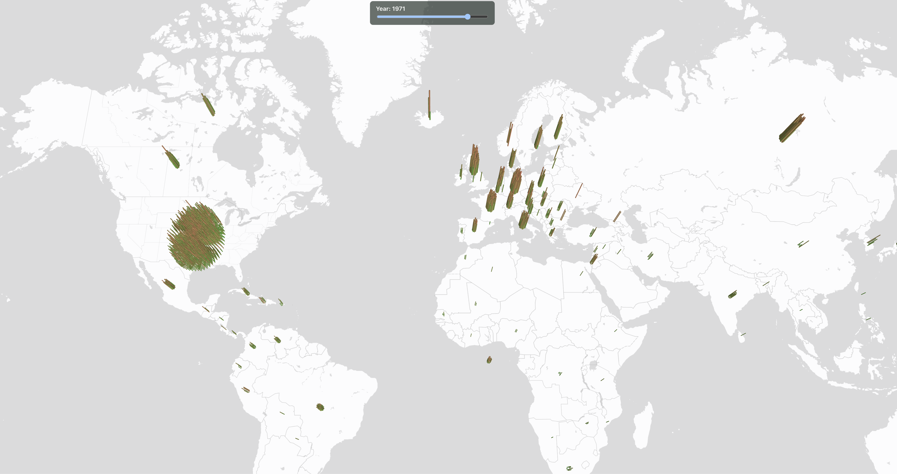

# AliveThen

**AliveThen** is an interactive 3D time-map that visualizes which artists were alive on Earth at any given year.

Inspired by the Museum of Modern Art (MoMA) collection and designed for extensibility, this project allows users to explore the lives of artists, thinkers, and other figures by time and geography.

## 🌍 What it does

- Visualizes artists on a 3D globe using **Deck.gl** and **Mapbox**
- Slider to select a year and dynamically update who was alive
- Each artist appears as a vertical box (the taller the box, the older the person)
- Spiral layout prevents overlap when multiple artists share a nationality
- Tooltips show artist name and age

## 📸 Screenshot

 <!-- Add when available -->
 <!-- Add when available -->
## 🚀 Tech Stack

- **React** + **Vite**
- **Deck.gl** for 3D rendering
- **Mapbox** for interactive maps
- **Custom spiral layout** for same-country positioning

## 🧠 Future Plans

- Filter by movement, museum, gender, or era
- Include other groups (philosophers, politicians, athletes, etc.)
- Mini timeline markers for each artwork
- Detail panel for selected artist

## 📦 Setup

```bash
git clone https://github.com/gulsenyilmaz/AliveThen.git
cd AliveThen
npm install
npm run dev


You'll need a .env file with your Mapbox token:
VITE_MAPBOX_TOKEN=your_token_here

📁 Data
Due to GitHub's file size limitations, the full artists.json is not included. You can download it from this link and place it in the /src/data/ directory.

Alternatively, use the included sample_artists.json to explore functionality.

Feel free to reach out or fork the project to build your own time-map!