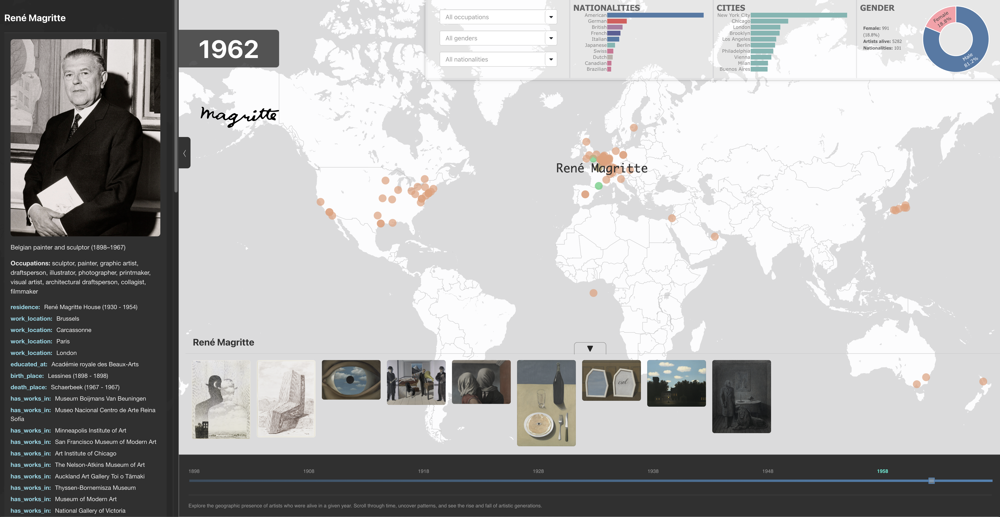
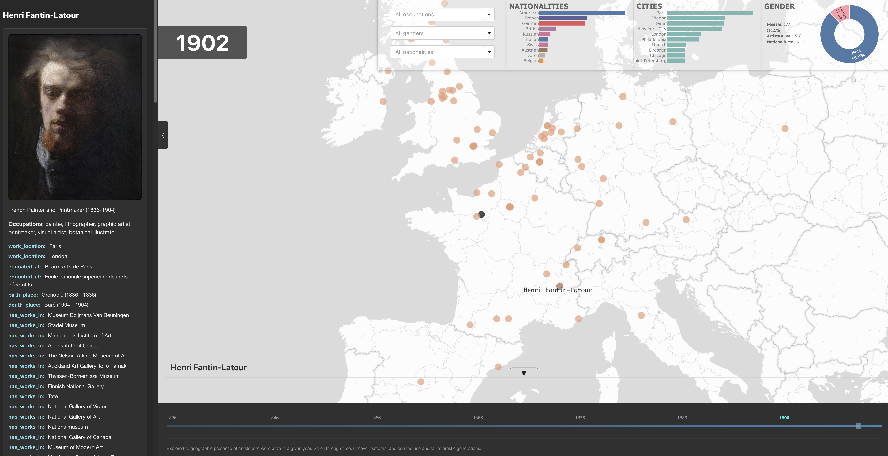
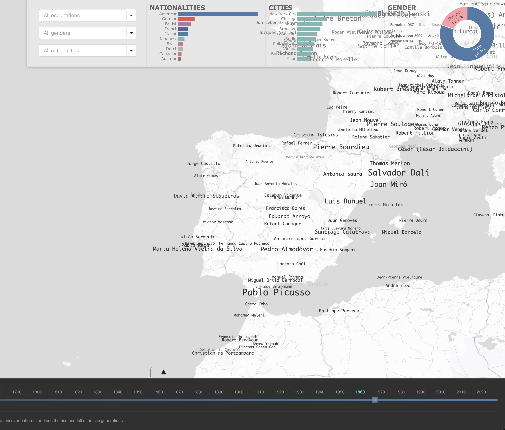

# AliveThen

**AliveThen** is an interactive data visualization project that maps artists (and other cultural figures) who were alive in a given year, based on the MoMA collection and extended metadata.

Inspired by the Museum of Modern Art (MoMA) collection and designed for extensibility, this project allows users to explore the lives of artists, thinkers, and other figures by time and geography.

## 🌍 What it does

- Visualizes artists on a 3D globe using **Deck.gl** and **Mapbox**
- Slider to select a year and dynamically update who was alive
- Animated arcs show geographic distribution by year.
- Spiral layout prevents overlap when multiple artists share a nationality
- Tooltips show artist name and age

## 📸 Screenshot

 <!-- Add when available -->
 <!-- Add when available -->
 <!-- Add when available -->

## 🚀 Technologies

- Frontend: React, Deck.gl, Plotly.js
- Backend: FastAPI
- Containerization: Docker, Docker Compose

## 🧠 Future Plans

- Filter by movement, museum, gender, or era
- Include other groups (philosophers, politicians, athletes, etc.)
- Mini timeline markers for each artwork
- Detail panel for selected artist

## 🧠 DATA SOURCE

- Museum of Modern Art Collection: https://github.com/MuseumofModernArt/collection

## Development Notes
- The frontend queries data from the backend on port 8000.

- Mapbox is used for base map layers. Add your Mapbox token to .env:
    VITE_MAPBOX_TOKEN=your_token_here

## 📦 Running the Project (with Docker)

Make sure you have Docker and Docker Compose installed.

```bash
git clone https://github.com/yourusername/alivethen.git
cd alivethen
docker compose up --build


AliveThen/
│
├── backend/           # FastAPI app and SQLite DB
├── frontend/          # React + Deck.gl app
├── docker-compose.yml
├── .dockerignore
└── README.md

